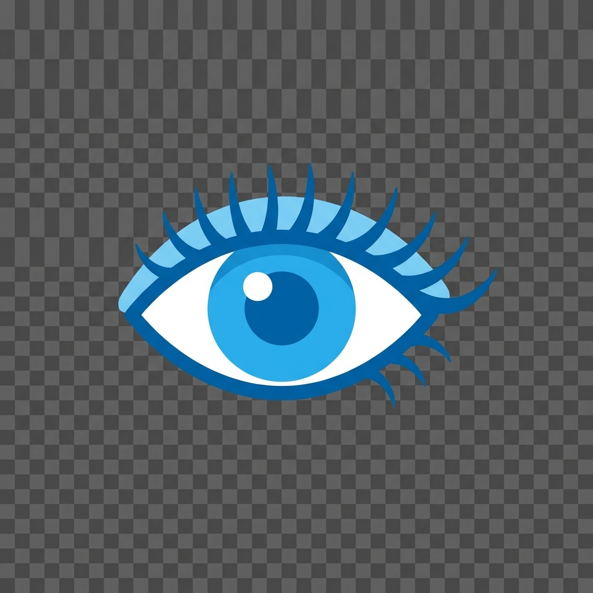

# 💧 NotifyMe

A modern Windows desktop application that helps you stay healthy by reminding you to blink your eyes, take walking breaks, stay hydrated, and practice pranayama at regular intervals.



Online docs: <https://atulkumar2.github.io/notifyme/>

## 📌 Table of Contents

- [Features](#features)
- [Quick Start](#quick-start)
- [Data Storage](#data-storage)
- [How to Use](#how-to-use)
- [Why These Reminders?](#why-these-reminders)
- [Configuration](#configuration)
- [Reminder Messages](#reminder-messages)
- [Technical Details](#technical-details)
- [License](#license)
- [Contributing](#contributing)
- [Connect](#connect)
- [Learn More](#learn-more)
- [Tips for Health](#tips-for-health)

## Features

- **Quad Reminders**: Eye blink reminders (default: 20 min), walking reminders (default: 60 min), water drinking reminders (default: 30 min), and pranayama reminders (default: 120 min)
- **Background Operation**: Runs silently in the system tray
- **Windows Toast Notifications**: Native Windows 10/11 notifications
- **Customizable Intervals**:
  - Blink reminders: 10-60 minutes
  - Walking reminders: 30-120 minutes
  - Water reminders: 20-90 minutes
  - Pranayama reminders: 60-240 minutes
- **Flexible Pause/Resume**: Pause all reminders at once, or pause each reminder type individually
- **Snooze Function**: Delay the next reminder by 5 minutes
- **Randomized Messages**: Variety of friendly reminder messages
- **Persistent Settings**: Your preferences are saved between sessions
- **Rolling Logs**: Log files automatically rotate to prevent disk space issues
- **Easy Access**: Quickly open log, config, and app locations from the system tray menu
- **Visual Menu Icons**: Emoji icons for easy navigation of menu options

## Quick Start

### Option 1: Download Pre-built Executable (Recommended)

1. **Download** the latest `NotifyMe.exe` from [GitHub Releases](../../releases/latest)
2. **Run** `NotifyMe.exe` - no installation required!
3. **Optional: Auto-start with Windows**:
   - Press `Win + R`, type `shell:startup`, press Enter
   - Copy `NotifyMe.exe` or create a shortcut there

### Option 2: Run from Source

#### Prerequisites

- Windows 10 or Windows 11
- Python 3.8 or higher

#### Installation

1. **Clone or download this repository**

2. **Run setup**:
   Double-click `setup.bat` to install `uv` and all dependencies automatically.

   Or manually with uv:

   ```bash
   uv sync
   ```

3. **Run the application**:
   Double-click `run.bat`

   Or manually:

   ```bash
   uv run notifyme.py
   ```

The application will appear in your system tray (look for the icon in the bottom-right corner of your screen).

### Building a Standalone Executable (For Developers)

You can create a portable `.exe` file that doesn't require Python:

1. **Build the executable**:
   Double-click `build.bat`

   Or manually:

   ```bash
   uv run pyinstaller --onefile --windowed --icon=icon.ico --name=NotifyMe --add-data "icon.png;." --add-data "icon.ico;." --add-data "help.html;." notifyme.py
   ```

2. **Find your executable** at `dist/NotifyMe.exe`

### Running Tests (For Developers)

The project includes comprehensive unit tests to ensure reliability:

1. **Run all tests**:
   Double-click `run_tests.bat`

   Or manually:

   ```bash
   uv run python -m pytest tests/test_notifyme.py -v
   ```

2. **Run tests with coverage**:

   ```bash
   uv run python -m pytest tests/test_notifyme.py --cov=notifyme --cov-report=html
   ```

3. **View coverage report**: Open `htmlcov/index.html` in your browser

The test suite covers:

- Configuration management
- Reminder intervals and timing
- Pause/resume functionality
- Menu creation and actions
- File location helpers
- Notification display
- System tray integration

## Data Storage

NotifyMe stores its configuration and logs in your user data folder:

- **Windows**: `%APPDATA%\NotifyMe\`
  - `config.json` - Your preferences
  - `notifyme.log` - Application logs

To open this folder:

- **Via System Tray**: Right-click the NotifyMe icon → **"📂 Open Locations"** → **"📄 Log Location"** or **"⚙ Config Location"**
- **Via Windows**: Press `Win + R`, type `%APPDATA%\NotifyMe`, press Enter

## How to Use

### Starting Reminders

1. Right-click the icon in the system tray
2. Open **"⚙ Controls"** and click **"▶ Start"** to begin receiving reminders
3. You'll receive blink reminders every 20 minutes, walking reminders every 60 minutes, water reminders every 30 minutes, and pranayama reminders every 120 minutes (defaults)
4. Hover over the system tray icon to see the current status of all reminders

### Customizing the Intervals

1. Right-click the system tray icon
2. Hover over **"Blink Reminder"**, **"Walking Reminder"**, **"Water Reminder"**, or **"Pranayama Reminder"**
3. Choose your preferred interval:
   - Blink: 10, 15, 20, 30, 45, or 60 minutes
   - Walking: 30, 45, 60, 90, or 120 minutes
   - Water: 20, 30, 45, 60, or 90 minutes
   - Pranayama: 60, 90, 120, 180, or 240 minutes

### Testing Notifications

1. Right-click the system tray icon
2. Hover over **"Test Notifications"**
3. Click **"Test Blink"**, **"Test Walking"**, **"Test Water"**, or **"Test Pranayama"** to preview notifications

### Pausing and Resuming

**Pause/Resume All:**

- Open **"⚙ Controls"** and click **"⏸ Pause All"** to temporarily stop all reminders
- Open **"⚙ Controls"** and click **"▶ Resume All"** to continue receiving all reminders

**Pause/Resume Individual Reminders:**

1. Hover over **"Blink Reminder"**, **"Walking Reminder"**, **"Water Reminder"**, or **"Pranayama Reminder"**
2. Click **"Pause/Resume"** to toggle that specific reminder
3. A checkmark (✓) indicates the reminder is currently paused
4. The system tray icon shows ⏸ next to paused reminders

### Snoozing a Reminder

- Click **"💤 Snooze (5 min)"** to delay the next reminder by 5 minutes

### Accessing Locations

Quickly access important files and folders:

1. Right-click the system tray icon
2. Hover over **"📂 Open Locations"**
3. Select:
   - **"📄 Log Location"** - Opens the folder containing application logs
   - **"⚙ Config Location"** - Opens the folder containing config.json
   - **"📦 App Location"** - Opens the folder containing the executable or script

### Quitting the Application

- Right-click the system tray icon
- Click **"❌ Quit"**

## Why These Reminders?

### Eye Blinking

When we focus on screens, we blink less frequently, which can lead to:

- Dry eyes
- Eye strain
- Blurred vision
- Headaches

### Walking Breaks

Prolonged sitting can cause:

- Poor circulation
- Muscle stiffness
- Increased health risks
- Reduced productivity

### Water Hydration

Staying hydrated is essential for:

- Brain function and focus
- Energy levels
- Healthy skin
- Proper digestion
- Overall health

### Pranayama Breathing

Short breathing breaks help:

- Reduce stress and tension
- Improve calm focus and clarity
- Reset shallow breathing patterns from long screen sessions
- Learn more: [NirogYoga Knowledge Base](https://www.nirogyoga.in/knowledge-base)

## Configuration

The app stores your preferences in `config.json`:

```json
{
  "interval_minutes": 20,
  "walking_interval_minutes": 60,
  "water_interval_minutes": 30,
  "pranayama_interval_minutes": 120,
  "sound_enabled": false,
  "last_run": null
}
```

You can manually edit this file to:

- Adjust the default `interval_minutes` for blink reminders
- Adjust the default `walking_interval_minutes` for walking reminders
- Adjust the default `water_interval_minutes` for water reminders
- Adjust the default `pranayama_interval_minutes` for pranayama reminders

## Reminder Messages

The app randomly selects from these friendly messages:

### Blink Reminders

- 👁️ Time to blink! Give your eyes a break.
- 💧 Blink reminder: Keep your eyes hydrated!
- ✨ Don't forget to blink and look away from the screen.
- 🌟 Eye care reminder: Blink 10 times slowly.
- 💙 Your eyes need a break - blink and relax!
- 🌈 Blink break! Look at something 20 feet away for 20 seconds.

### Walking Reminders

- 🚶 Time for a walk! Stretch your legs.
- 🏃 Walking break: Get up and move around!
- 🌿 Take a short walk - your body will thank you.
- 💪 Stand up and walk for a few minutes!
- 🚶‍♂️ Sitting too long? Time for a walking break!
- 🌞 Walk around for 5 minutes - refresh your mind and body!

### Water Reminders

- 💧 Time to hydrate! Drink a glass of water.
- 🚰 Water break: Stay hydrated for better health!
- 💦 Don't forget to drink water - your body needs it!
- 🌊 Hydration reminder: Drink some water now.
- 💙 Keep yourself hydrated - drink water regularly!
- 🥤 Water time! Drink at least 250ml now.

### Pranayama Reminders

- 🧘 Pranayama break: Slow, deep breathing for 2-3 minutes.
- 🌬️ Breathing reminder: Inhale 4, hold 4, exhale 6.
- 🫁 Reset with pranayama: Calm breath, clear mind.
- 🧘‍♀️ Pause and breathe: Gentle pranayama now.
- 🌿 Take a breathing break: Relax your shoulders and breathe.
- 🧘‍♂️ Pranayama time: Smooth, steady breaths.

## Technical Details

**Built with:**

- Python 3.13+
- `pystray` - System tray integration
- `winotify` - Windows toast notifications
- `Pillow` - Icon image processing

## License

This project is free to use and modify for personal use.

## Contributing

Feel free to submit issues or pull requests to improve the application!

### Pre-commit Version Check

This repo includes a pre-commit hook that verifies:

- `APP_VERSION` in `notifyme.py` matches the `version` in `pyproject.toml`
- The local version is **not older** than the latest GitHub release

To enable the hook locally:

```bash
python -m pip install pre-commit
pre-commit install
```

If you're offline, you can skip the GitHub check by setting:

```bash
SKIP_GITHUB_VERSION_CHECK=1
```

## Connect

- [X (Twitter)](https://x.com/_AtulKumar2_/)
- [LinkedIn](https://www.linkedin.com/in/atulkumar88/)

## Learn More

- [20-20-20 rule (American Optometric Association)](https://www.aoa.org/healthy-eyes/eye-and-vision-conditions/computer-vision-syndrome)
- [Sitting and sedentary behavior (CDC)](https://www.cdc.gov/physicalactivity/basics/sitting-health/index.htm)
- [Water intake and hydration basics (NHS)](https://www.nhs.uk/live-well/eat-well/water-drinks-nutrition/)
- [Breathing exercises for stress (NHS)](https://www.nhs.uk/mental-health/self-help/guides-tools-and-activities/breathing-exercises-for-stress/)

## Tips for Health

- **20-20-20 Rule**: Every 20 minutes, look at something 20 feet away for 20 seconds
- **Blink consciously**: Try to blink 10-15 times when you get a reminder
- **Adjust screen brightness**: Match your screen brightness to your surroundings
- **Use proper lighting**: Avoid glare and ensure adequate ambient lighting
- **Take regular breaks**: Stand up and move around every hour
- **Stay hydrated**: Drink at least 8 glasses (2 liters) of water throughout the day
- **Set a hydration goal**: Track your water intake to ensure you're drinking enough
- **Pranayama reset**: Take 2-3 minutes of slow breathing every couple of hours

---

## Stay healthy! 👁️🚶💧🧘✨
